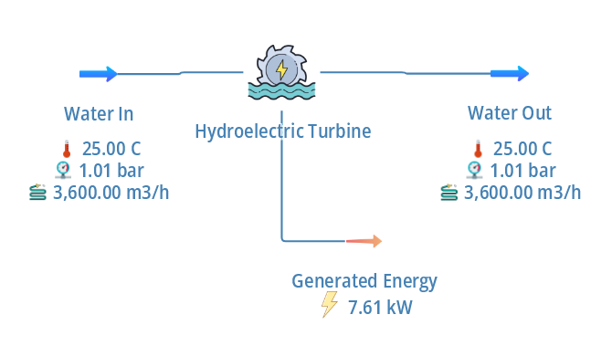
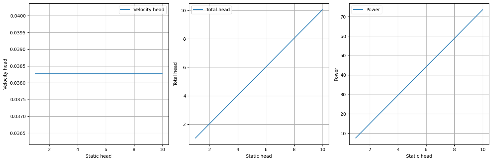
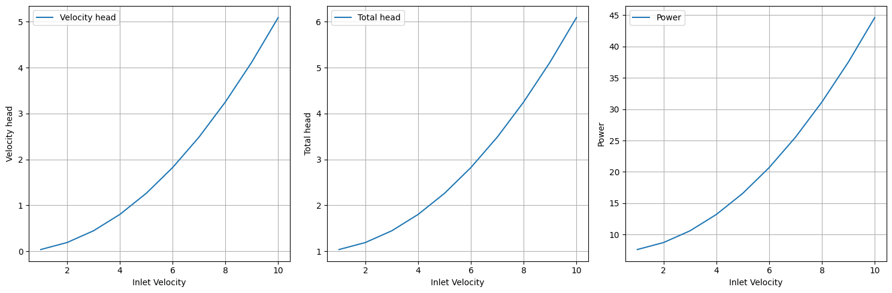

## Automation of Hydroelectric Turbines

## Objective

To develop a python script to understand how automation will work in DWSim and to get the attributes of Hydroelectric Turbines and print it on terminal

To get a range of results for a range of static head and inlet velocity for a constant volumetric flow rate

## Data

## DWSIM Blocks Used

Material Stream

Hydroelectric Turbines

Energy Stream

## Thermodynamic Package

Steam tables

## Resutls in Graphical Format

 

